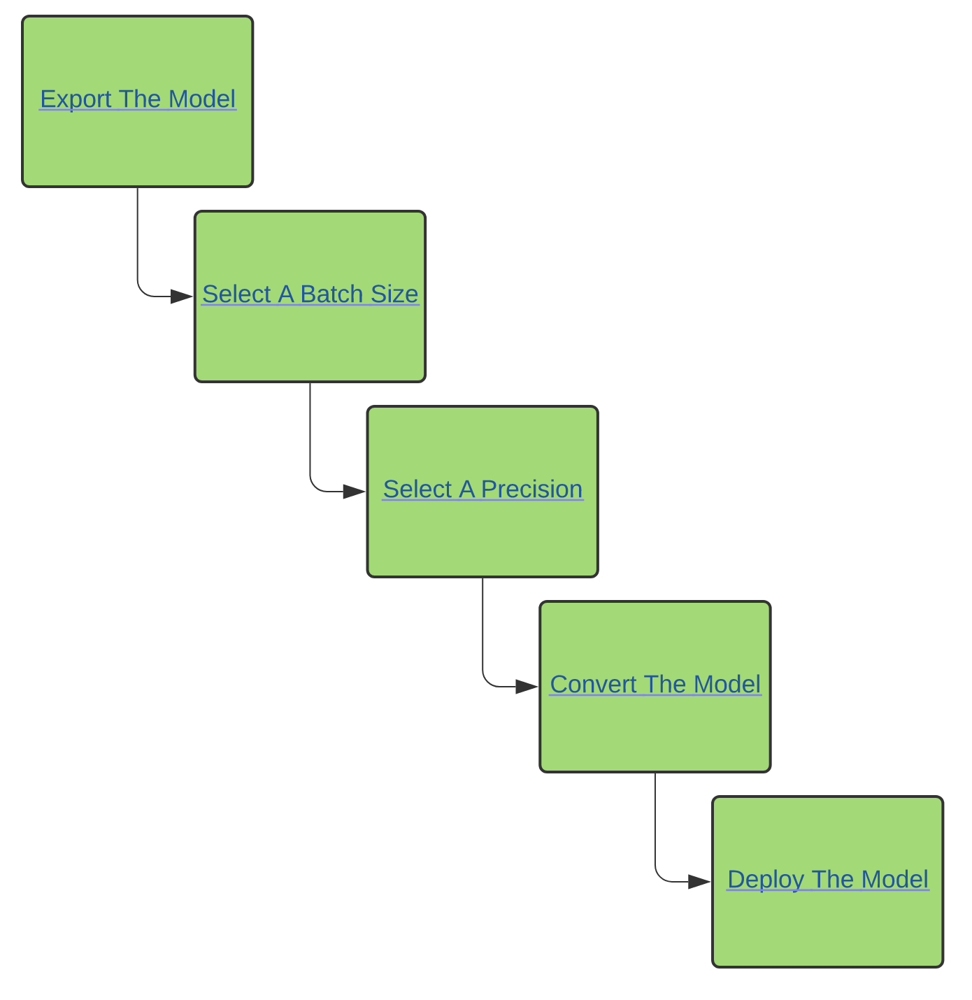
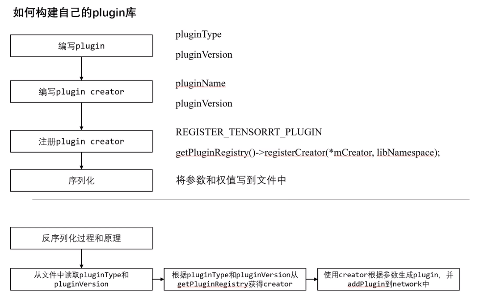

# TensorRT教程
NVIDIA TensorRT是一种高性能神经网络推理(Inference)引擎，
用于在生产环境中部署深度学习应用程序，应用有图像分类、分割和目标检测等，
可提供最大的推理吞吐量和效率。
TensorRT是第一款可编程推理加速器，能加速现有和未来的网络架构。
依赖cuda、cudnn，并对其进行了封装


## 模型构建阶段
1. 根据模型的结构使用TRT API复现该模型定义的网络
2. 使用builder生成一个优化后的engine
3. 将engine序列化到文件中，即生成一个plan格式的模型文件
4. 读取序列化后的plan格式的模型文件，并对其进行前向推理(inference)操作

## TensorRT的运行机制
1. 定义网络
2. 模型构建
3. 执行前向推理(inference)

## TensorRT使用的注意事项
1. TensorRT构建的模型不是跨平台的，TensorRT构建的过程中依赖于软硬件的优化，在模型构建阶段，TensorRT会根据GPU的特性和输入数据的大小，选择最后的实现，因此在执行模型构建和模型推理的过程中最好都在一块显卡上操作
2. 

## 自定义插件流程
1. 构建自定义插件库的序列化模型类
   ```
   class YoloLayerPlugin: public IPluginV2IOExt
   ```
2. 构建插件库反序列化模型类

    ```
    class YoloPluginCreator : public IPluginCreator
    ```


3. 定义插件
```
namespace nvinfer1
{

//!
//! \brief Register the plugin creator to the registry
//! The static registry object will be instantiated when the plugin library is
//! loaded. This static object will register all creators available in the
//! library to the registry.
//!
template <typename T>
class PluginRegistrar
{
public:
    PluginRegistrar() { getPluginRegistry()->registerCreator(instance, ""); }
private:
    T instance{};
};

#define REGISTER_TENSORRT_PLUGIN(name) \
    static nvinfer1::PluginRegistrar<name> pluginRegistrar##name {}

} // namespace nvinfer1
```
   * 注册表类型为PluginRegistrar，可以通过REGISTER_TENSORRT_PLUGIN宏定义函数获取注册表的全局单例。
REGISTER_TENSORRT_PLUGIN(YoloPluginCreator);
 TensorRT是通过宏定义的方式注册各种插件，在编译阶段自动执行宏替换就注册了所有的插件. 每一个插件类型只允许注册一次。使用宏来控制插件的注册：
 REGISTER_LAYER_CLASS宏可以实现将指定Layer注册到全局注册表中，首先定义一个工厂函数用来产生Layer对象，然后调用REGISTER_LAYER_CREATOR将工厂函数和Layer的类型名进行注册，支持两种Layer的数据类型，float和double。两个变量一个对应float，一个对应double，这两个变量的初始化，也就是它们的构造函数实际上完成Layer的注册动作。REGISTER_LAYER_CLASS实际上是为每一个Layer创建一个creator函数.

4. 参数说明
   * PluginFieldCollection:定义各种参数
   * 


